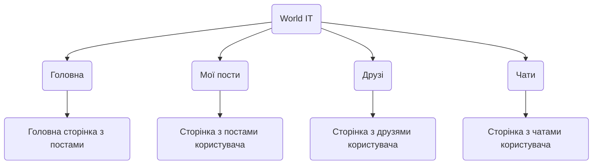

# World IT - Соціальна мережа


#### Наш проект був створенний для тих, хто має повагу до себе, та користуется лише гарними продуктами. Цей проект буде корисним не тільки для звичайного користувача, а й для продвинутого юзера.

# Зміст
 - [World IT - Соціальна мережа](#world-it---соціальна-мережа)
 - [Зміст](#зміст)
 - [Структура проекту](#структура-проекту)
 - [Запуск та встановлення](#запуск-та-встановлення)

# Діаграма-структура проекту



# Запуск та встановлення
### 1. Встановлення
Щоб встановити наш додаток, вам потрібно:
- Відкрити папки у Visual Studio Code(у різних вікнах).
- Зверху у меню Visual Studio Code відкрити нові термінали(в обох вікнах), спочатку ввести команду.
- Ввести команди
  #### У першій папці
  ```
  git clone https://github.com/PrymushAnton/reactNativeMySpace
  ```
  #### У другій папці
  ```
  git clone https://github.com/PrymushAnton/expressMySpace
  ```
- Після цього, вводимо команду, яка встановлює всі необхідні бібліотеки
  
  ```
  npm i
  ```

- Налаштовуємо зв'язок між папками
  
  Для того, щоб все працювало гарно, нам потрібно налаштувати зв'язок між папками, для цього, відкриваємо **Командний рядок**, я буду його відкривати через **Пошук** у нижній частині екрану
  
  **Приклад **Командного рядку** у пошуку**

  

  Після того, як ми відкрили **Командний рядок**, нам потрібно ввести команду `ipconfig`

  **Приклад результату**(числа були змінені)

  

  Нам потрібні значення саме зі строки **IPv4-адреса**

- Після того, як ми дізналися наш IP, у [першій папці](#у-першій-папці) потрібно замінити ці значення у файлі `base-url.ts`
  
  

- Після цього, нам потрібно встановити MySQL Workbench, ви можете це зробити за допомогою цієї [відео-інструкції](https://youtu.be/IBEAr_9_Q04?si=r0JkkU8BUB3EbZTy), або за описом нижче

1. Вам потрібно вбити у пошук в браузері **"mysql workbench"**, або перейти по [ссилці](https://www.mysql.com/products/workbench/)
   
2. Після цього, вам потрібно натиснути **Download now**

   

3. Після того, як ви натиснули на **Download now**, вас перекинє на сайт з великим банером, на який вам потрібно буде натиснути, зверніть увагу на вашу операційну систему, її можна змінити
  
   

4. Тепер вам потрібно завантажити файл-установник, для цього треба натиснути **Download**, зверніть увагу, нам потрібен той файл, котрий більше, за інший

    

5. Вас перекинє на сторінку, де вам запропонують зареєструватись, але нам реєструватись непотрібно, тому натискаємо на **No thanks, just start my download.**
   
   

6. Після того, як у нас встановиться та відкриється файл-установник, нам потрібно вибрати **Custom**, та натиснути **Next**

   

7. Після цього, в вас відкриєтся вікно, де вам потрібно буде обрати **Сервер** та **Воркбенч**, для цього потрібно:
   - MySQL Servers → MySql Server → MySQL Server LastVersion → MySQL Server LastVersion - Xbit
   - Applications → MySQL Workbench → MySQL Workbench LastVersion → MySQL Workbench LastVersion - Xbit
  
    Після того, як ви обрали, треба натиснути на зелену стрілку, після цього натиснути **Next**

    **Як повинно виглядати після того, як ви все зробили правильно**

   

8. Після того, як ви додали Сервер та Воркбенч, треба буде декілька разів натиснути **Next**

9. На сторінці з паролем, вам треба буде вигадати пароль, в мене пароль буде `root123`(його треба запам'ятати, він нам ще знадобиться), натискаємо **Next**
    
    **Як все повинно виглядати, коли ви напишите свій пароль**

   

10. Після всіх цих пунктів, ви просто натискаєте **Next** або **Execute**, якщо все добре, то помилок не повинно бути


Коли ми встановили собі MySQL Workbench, нам потрібно знові відкрити **Командний рядок**, та ввести команду
```
create database myspace character set utf8 collate utf8_general_ci;
```
**myspace** - це назва моєї бази даних, ви можете створити базу даних з іншою назвою

- Після цього, у [другій папці](#у-другій-папці) ми створюємо файл з назвою `.env`, куди нам потрібно ввести наступні данні
  
```
DATABASE_URL = "mysql://назва юзеру(за замовчуванням root):пароль@IP(за замовчуванням localhost):порт(за замовчуванням 3306)/назва бази даних"

SMTP_HOST=smtp.gmail.com
SMTP_PORT=587
SMTP_USER=пошта, котру треба створити з двухфакторною аутентифікацією@gmail.com
SMTP_PASS=пароль
```

**Приклад, як це повинно виглядати у фіналі**


Після того, як ми додали аккаунт, та шлях до бази даних, потрібно провести міграції, та створити кліента

1. Створюємо кліента
```
npx prisma generate
```

2. Проводимо міграції
```
npm run prisma:migrate 
```

**Тепер можна запускати проект**

  ```
  npm run clear 
  ```
  **[Для першої папки ↑](#у-першій-папці)**
  ```
  npm run server
  ```
  **[Та для другої папки ↑](#у-другій-папці)**

### 2. Запуск
Щоб запустити додаток, потрібно встановити додаток Expo Go на телефон, та відсканувати QR-код, котрий буде відображатися у терміналі.

**Приклад QR-коду у терміналі.**


Скануємо його у телефоні через додаток


## Основні технології проєкту

### Frontend


### Backend


### Інше


## Особливості розробки нашого проєкту

### Робота з зображеннями

У нашому застосунку користувач може додавати до 9 зображень до кожного посту. Зображення завантажуються через компонент `ImagePicker`, передаються на сервер, зберігаються у папці, а в базу додається шлях. Після цього зображення відображаються на фронті у вигляді адаптивної сітки.

---

### Робота з веб-сокетами

Ми реалізували веб-сокети для чатів (індивідуальних і групових). При відкритті чату користувач підключається до кімнати, а нові повідомлення передаються всім учасникам в реальному часі.

---

### Пости, альбоми, налаштування, чати

- **Пости**: користувачі можуть створювати, редагувати та видаляти пости з фото й текстом. Вони зберігаються у базі разом з автором та часом публікації.
- **Альбоми**: дозволяють зберігати фото по категоріях. Кожен альбом має назву та набір зображень.
- **Налаштування профілю**: у профілі можна змінити ім’я, нікнейм, аватар. Усі зміни відправляються на бекенд.
- **Чати**: реалізовані моделі `ChatGroup` і `ChatMessage`. Підтримується історія, списки учасників, і реальний час завдяки сокетам.

---

### Реєстрація та авторизація

Користувач реєструється через email та пароль. На пошту надходить код, який потрібно підтвердити. Сесія зберігається у `AsyncStorage` за допомогою JWT-токена.

---

### Друзі та додавання користувачів до списку

Система дружби працює на основі моделі `Friendship`. Можна надіслати запит у друзі, прийняти або відхилити його. Є секції **"Запити"**, **"Рекомендації"**, **"Всі друзі"**, які показують відповідних користувачів.

---

### Відео з роботю проекта


---

### 📎 Посилання на ключові файли з кодом:

- **Реєстрація/авторизація**: [user.service.ts](https://github.com/PrymushAnton/expressMySpace/blob/master/src/userApp/user.service.ts)
- **Пости**: [post.service.ts](https://github.com/PrymushAnton/expressMySpace/blob/master/src/PostApp/post.service.ts)
- **Друзі**: [friend.service.ts](https://github.com/PrymushAnton/expressMySpace/blob/master/src/FriendApp/friend.service.ts)
- **Чати**: [chat.service.ts](https://github.com/PrymushAnton/expressMySpace/blob/master/src/ChatApp/chat.service.ts)

# Висновок

Створення проєкту **World IT** стало для нас не лише технічним викликом, а й надзвичайно цінним практичним досвідом, який охопив усі етапи життєвого циклу сучасного застосунку: від архітектури бекенду до інтерфейсів користувача на мобільному пристрої. Робота над повноцінною соціальною мережею, яка включає авторизацію, створення та редагування постів, додавання в друзі, чати та профілі користувачів, дозволила нам значно поглибити знання в сфері розробки та зрозуміти багато ключових принципів.

Почнемо з того, що проєкт дозволив нам краще опанувати **повний стек технологій**. На фронтенді ми використовували **React Native** разом із **TypeScript** та **Expo**, що дало можливість створити кросплатформенний мобільний застосунок із сучасним дизайном та плавною навігацією. Особливо корисним був досвід інтеграції UI з бекендом через асинхронні API-запити, обробку форм за допомогою `yup`, `react-hook-form`, а також реалізацію валідації даних на клієнтській стороні.

З боку бекенду ми створили REST API за допомогою **Express.js**, організували логічну структуру проєкту та підключили **Prisma** як ORM для взаємодії з базою даних MySQL. Практичне налаштування MySQL Workbench та конфігурація змінних середовища через `.env` дало нам краще розуміння того, як працюють серверні застосунки в реальних умовах. Ми навчилися проводити міграції, створювати моделі, встановлювати зв’язки типу one-to-one та one-to-many, а також обробляти критичні помилки.

Окремо хочемо відзначити реалізацію **функціоналу чатів** — як групових, так і приватних. Це дало нам можливість попрактикуватися в проєктуванні складних моделей взаємодії між користувачами, реалізувати логіку повідомлень і налаштувати роботу з базою даних для динамічної взаємодії. Також це зміцнило наші знання з побудови зв’язків між сутностями, обробки запитів і роботи з асинхронними даними.

Проєкт змусив нас звернути увагу не лише на технічну сторону, але й на **UX/UI**. Ми намагалися зробити інтерфейс інтуїтивно зрозумілим, зручним і візуально привабливим. Зокрема, ми реалізували модальні вікна, логіку автозапуску сценаріїв (наприклад, редагування профілю при першому вході) та збереження сесії користувача.

Крім цього, ми здобули знання про **CI/CD-підходи**, тестування застосунку на реальних пристроях за допомогою Expo Go, налаштування поштових сервісів для верифікації, а також правильну організацію обробки помилок на обох рівнях — фронтенді та бекенді.

Дуже цінним був досвід **створення документації**. Підготовка повного README з інструкціями щодо встановлення, запуску, налаштування середовища та бази даних навчила нас пояснювати логіку роботи застосунку так, щоб нею міг скористатися будь-хто. Це допомогло критично подивитися на власну роботу й оформити її як повноцінний продукт.

У результаті роботи над цим проєктом ми навчилися ефективно співпрацювати в команді, ділити задачі, планувати структуру застосунку, писати масштабований та підтримуваний код. Проєкт **World IT** став для нас не лише перевіркою знань, а й доказом того, що ми можемо створити складний, повнофункціональний застосунок, який справді працює, виглядає професійно та приносить користь.

Цей досвід був для нас надзвичайно корисним, і ми впевнені, що він стане фундаментом для подальших більш складних і амбітних проєктів.
